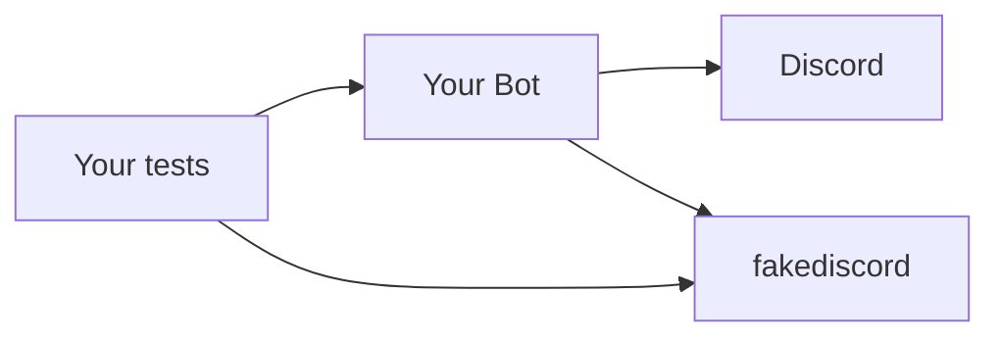
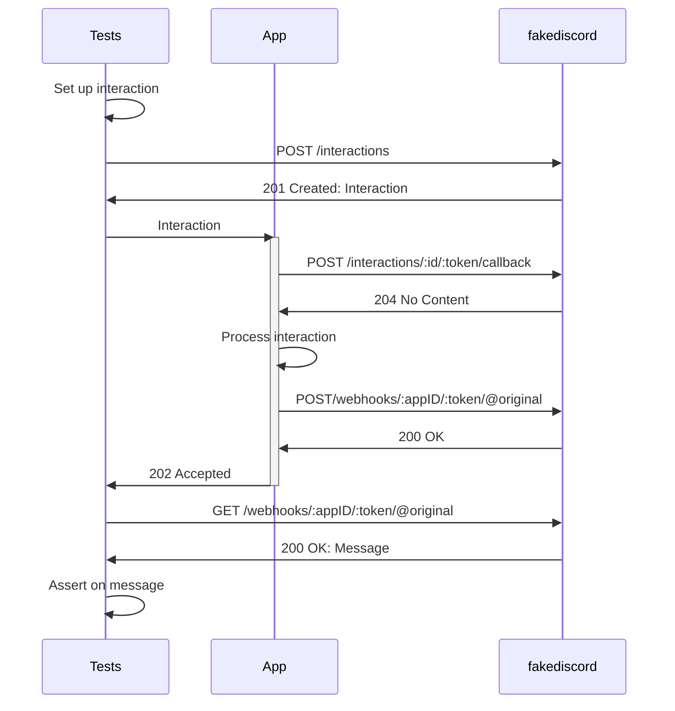

# fakediscord

The aim of `fakediscord` is to replicate the behaviour of the Discord HTTP and Websocket APIs, based on the documentation and observed behaviour, in order to enable the integration testing of Discord bots without calling the real Discord API. 

Analogous to [LocalStack](https://github.com/localstack/localstack), `fakediscord` should be run locally using Docker when running your bot's tests.

While written in Go, `fakediscord` can be used to test bots in any language, provided they adhere to Discord's specifications.




`fakediscord` fakes the HTTP and WebSocket endpoints of the Discord API, triggering corresponding events via the WebSocket connection. `fakediscord` pairs well with (and is based on the hard work of) [bwmarrin/discordgo](https://github.com/bwmarrin/discordgo). 

Of course, you should also test your bot manually before releasing to the public: there are many features currently not present, such as authorization, -- any action is currently allowed.

## Usage

`fakediscord` should work with any Discord client in any language, and is intended to be run via Docker:

```shell
docker run -p 8080:8080 ghcr.io/elliotwms/fakediscord:{version}
```

It is possible to provide a `config.yml` file to bootstrap users and guilds (todo: document config): 

```yaml
services:
  fakediscord:
    image: ghcr.io/elliotwms/fakediscord:{version}
    ports:
      - 8080:8080
    volumes:
      - ${PWD}/fakediscord.yaml:/config.yml:ro
```

`fakediscord` provides a Go client as a convenience wrapper for internal endpoints, as well as a shim for discordgo to allow you to override the endpoints, which can be found in `pkg/fakediscord`.

Override the Discord Base URL to `fakediscord`'s, then proceed to use your client as normal:

```go
package main

import "github.com/elliotwms/fakediscord/pkg/fakediscord"

func main() { 
	// override discordgo URLs
	fakediscord.Configure("http://localhost:8080") 
	
	// Client for internal endpoints (e.g. interactions)
	c := fakediscord.NewClient()
}
```

### Authentication

* Any token value will pass authentication (`Bot {token}`)
* If the token matches one specified in the config then the relevant user will be authenticated
* Otherwise, a user will be generated with the token value as the username
* For testing purposes, all users are assumed to be in all guilds

### Interactions

`fakediscord` provides an endpoint for triggering interactions, which would normally only be possible via a user initiating via the UI. A `POST` of an `InteractionCreate` event to `/api/:version/interactions` will create an interaction.

A suggested pattern for testing interactions within a webhook application would be as follows: 

1. Build the expected interaction within your test suite
2. Create the initial interaction in `fakediscord`. This will provide you with IDs, tokens etc
3. Send the interaction to your application's endpoint
4. Your application will likely call the [interaction's callback url](https://discord.com/developers/docs/interactions/receiving-and-responding#interaction-callback) to acknowledge the interaction



## Features

`fakediscord` currently supports the following API operations, and emits the corresponding [events](https://discord.com/developers/docs/topics/gateway-events):

#### Gateway

* Get Gateway
* Connect
  * `HELLO`
  * `READY`
  * [`GUILD_CREATE`](https://discord.com/developers/docs/events/gateway-events#guild-create)

### Guilds

* [Create](https://discord.com/developers/docs/resources/guild#create-guild)
  * [`GUILD_CREATE`](https://discord.com/developers/docs/events/gateway-events#guild-create)
* [Get](https://discord.com/developers/docs/resources/guild#get-guild)
* [Delete](https://discord.com/developers/docs/resources/guild#delete-guild)
  * [`GUILD_DELETE`](https://discord.com/developers/docs/events/gateway-events#guild-delete)
* [Get channels](https://discord.com/developers/docs/resources/guild#get-guild-channels)
* [Create channel](https://discord.com/developers/docs/resources/guild#create-guild-channel)
  * [`CHANNEL_CREATE`](https://discord.com/developers/docs/events/gateway-events#channel-create)

### Channels

* [Get](https://discord.com/developers/docs/resources/channel#get-channel)
* [Delete](https://discord.com/developers/docs/resources/channel#deleteclose-channel)
  * [`CHANNEL_DELETE`](https://discord.com/developers/docs/events/gateway-events#channel-delete)
* [Get Pinned Messages](https://discord.com/developers/docs/resources/channel#get-pinned-messages)
* [Pin Message](https://discord.com/developers/docs/resources/channel#pin-message)
  * [`CHANNEL_PINS_UPDATE`](https://discord.com/developers/docs/events/gateway-events#channel-pins-update)

### Messages

* [Create Message](https://discord.com/developers/docs/resources/message#create-message)
  * [`MESSAGE_CREATE`](https://discord.com/developers/docs/events/gateway-events#message-create)
  * Supports basic, embeds and multipart 
* [Get Message](https://discord.com/developers/docs/resources/message#get-channel-message)
* [Delete Message](https://discord.com/developers/docs/resources/message#delete-message)
  * [`MESSAGE_DELETE`](https://discord.com/developers/docs/resources/message#delete-message)
* [Get Message Reactions](https://discord.com/developers/docs/resources/message#get-reactions)
* [Create Reaction](https://discord.com/developers/docs/resources/message#create-reaction)
  * [`MESSAGE_REACTION_ADD`](https://discord.com/developers/docs/events/gateway-events#message-reaction-add)
* [Delete Reactions](https://discord.com/developers/docs/resources/message#delete-all-reactions)
  * [`MESSAGE_REACTION_REMOVE_ALL`](https://discord.com/developers/docs/events/gateway-events#message-reaction-remove-all)

### Interactions

* Create (see [docs](#interactions))
* [Callback](https://discord.com/developers/docs/interactions/receiving-and-responding#interaction-callback)

## Examples

Check out how the following projects use `fakediscord` for inspiration:

### [Pinbot](https://github.com/elliotwms/pinbot/tree/master/tests)

* Docker [Compose](https://github.com/elliotwms/pinbot/blob/master/compose.yaml) contains Pinbot config, including the bot user in [fakediscord.yaml](https://github.com/elliotwms/pinbot/blob/master/fakediscord.yaml)
* [TestMain](https://github.com/elliotwms/pinbot/blob/20debf13a3dff8e58b7d61ec5e04c18c1542be3d/tests/setup_test.go#L21) calls `fakediscord.Configure` to set base URLs etc, sets up the client, creates a test guild for the run and opens a general session for the test suite
* Individual tests then create channels in the test guild to execute their tests within ([example](https://github.com/elliotwms/pinbot/blob/20debf13a3dff8e58b7d61ec5e04c18c1542be3d/tests/pin_test.go#L7))
