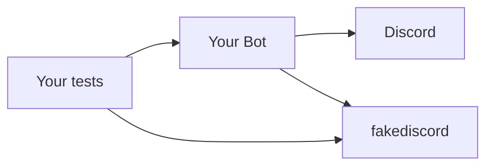
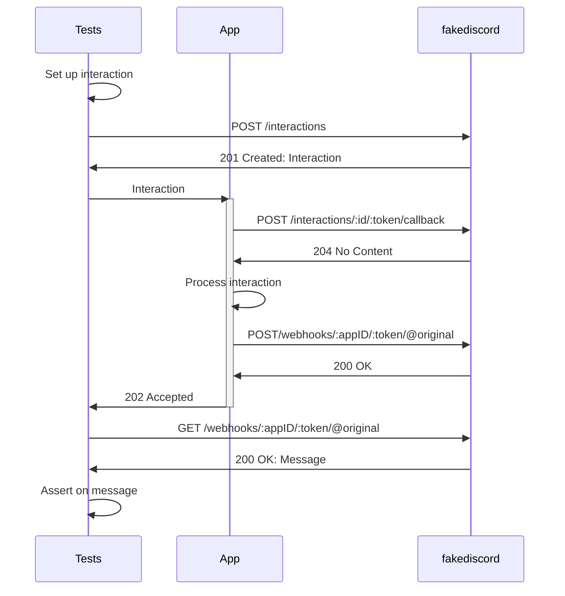

# fakediscord

A highly experimental fake Discord server, intended to enable testing Discord bots without calling the real Discord API,
analogous to [LocalStack](https://github.com/localstack/localstack).

This allows you to write integration tests for your bots, without depending on the Discord API.



## Features

`fakediscord` fakes the HTTP and WebSocket endpoints of the Discord API, triggering corresponding events via the WebSocket connection. `fakediscord` pairs well with (and is based on the hard work of) [bwmarrin/discordgo](https://github.com/bwmarrin/discordgo). While written in Go, `fakediscord` can be used to test bots in any language, provided they adhere to Discord's specifications.

Of course, you should also test your bot manually before releasing to the public, as there's a few things `fakediscord` **doesn't** intend to implement, including:

* Authorization - any action is allowed

## Usage

`fakediscord` should work with any Discord client in any language, and is intended to be run via a Docker container:

```shell
docker run ghcr.io/elliotwms/fakediscord:{version}
```

It is possible to provide a `config.yml` file to bootstrap users and guilds: 

```yaml
services:
  fakediscord:
    image: ghcr.io/elliotwms/fakediscord:{version}
    ports:
      - 8080:8080
    volumes:
      - ${PWD}/fakediscord.yaml:/config.yml:ro
```

`fakediscord` provides a Go client as a convenience wrapper for internal endpoints, as well as a shim for discordgo to allow you to override the endpoints, which can be found in `pkg/fakediscord`.

Override the Discord Base URL to `fakediscord`'s, then proceed to use your client as normal:

```go
package main

import "github.com/elliotwms/fakediscord/pkg/fakediscord"

func main() { 
	// override discordgo URLs
	fakediscord.Configure("http://localhost:8080") 
	
	// Client for internal endpoints (e.g. interactions)
	c := fakediscord.NewClient()
}
```

### Interactions

`fakediscord` provides an endpoint for triggering interactions, which would normally only be possible via a user initiating via the UI. A `POST` of an `InteractionCreate` event to `/api/:version/interactions` will create an interaction.

A suggested pattern for testing interactions within a webhook application would be as follows: 

1. Build the expected interaction within your test suite
2. Create the initial interaction in `fakediscord`. This will provide you with IDs, tokens etc
3. Send the interaction to your application's endpoint
4. Your application will likely call the [interaction's callback url](https://discord.com/developers/docs/interactions/receiving-and-responding#interaction-callback) to acknowledge the interaction



## [Events](https://discord.com/developers/docs/topics/gateway-events)

As we develop `fakediscord` we will be aiming to implement each of the documented events along with their corresponding API interactions:

- [ ] [Hello](https://discord.com/developers/docs/topics/gateway-events#hello)
- [x] [Ready](https://discord.com/developers/docs/topics/gateway-events#ready)
- [ ] [Resumed](https://discord.com/developers/docs/topics/gateway-events#resumed)
- [ ] [Reconnect](https://discord.com/developers/docs/topics/gateway-events#reconnect)
- [ ] [Invalid Session](https://discord.com/developers/docs/topics/gateway-events#invalid-session)
- [ ] [Application Command Permissions Update](https://discord.com/developers/docs/topics/gateway-events#application-command-permissions-update)
- [ ] [Auto Moderation Rule Create](https://discord.com/developers/docs/topics/gateway-events#auto-moderation-rule-create)
- [ ] [Auto Moderation Rule Update](https://discord.com/developers/docs/topics/gateway-events#auto-moderation-rule-update)
- [ ] [Auto Moderation Rule Delete](https://discord.com/developers/docs/topics/gateway-events#auto-moderation-rule-delete)
- [ ] [Auto Moderation Action Execution](https://discord.com/developers/docs/topics/gateway-events#auto-moderation-action-execution)
- [x] [Channel Create](https://discord.com/developers/docs/topics/gateway-events#channel-create)
- [ ] [Channel Update](https://discord.com/developers/docs/topics/gateway-events#channel-update)
- [x] [Channel Delete](https://discord.com/developers/docs/topics/gateway-events#channel-delete)
- [x] [Channel Pins Update](https://discord.com/developers/docs/topics/gateway-events#channel-pins-update)
- [ ] [Thread Create](https://discord.com/developers/docs/topics/gateway-events#thread-create)
- [ ] [Thread Update](https://discord.com/developers/docs/topics/gateway-events#thread-update)
- [ ] [Thread Delete](https://discord.com/developers/docs/topics/gateway-events#thread-delete)
- [ ] [Thread List Sync](https://discord.com/developers/docs/topics/gateway-events#thread-list-sync)
- [ ] [Thread Member Update](https://discord.com/developers/docs/topics/gateway-events#thread-member-update)
- [ ] [Thread Members Update](https://discord.com/developers/docs/topics/gateway-events#thread-members-update)
- [x] [Guild Create](https://discord.com/developers/docs/topics/gateway-events#guild-create)
- [ ] [Guild Update](https://discord.com/developers/docs/topics/gateway-events#guild-update)
- [ ] [Guild Delete](https://discord.com/developers/docs/topics/gateway-events#guild-delete)
- [ ] [Guild Ban Add](https://discord.com/developers/docs/topics/gateway-events#guild-ban-add)
- [ ] [Guild Ban Remove](https://discord.com/developers/docs/topics/gateway-events#guild-ban-remove)
- [ ] [Guild Emojis Update](https://discord.com/developers/docs/topics/gateway-events#guild-emojis-update)
- [ ] [Guild Stickers Update](https://discord.com/developers/docs/topics/gateway-events#guild-stickers-update)
- [ ] [Guild Integrations Update](https://discord.com/developers/docs/topics/gateway-events#guild-integrations-update)
- [ ] [Guild Member Add](https://discord.com/developers/docs/topics/gateway-events#guild-member-add)
- [ ] [Guild Member Remove](https://discord.com/developers/docs/topics/gateway-events#guild-member-remove)
- [ ] [Guild Member Update](https://discord.com/developers/docs/topics/gateway-events#guild-member-update)
- [ ] [Guild Members Chunk](https://discord.com/developers/docs/topics/gateway-events#guild-members-chunk)
- [ ] [Guild Role Create](https://discord.com/developers/docs/topics/gateway-events#guild-role-create)
- [ ] [Guild Role Update](https://discord.com/developers/docs/topics/gateway-events#guild-role-update)
- [ ] [Guild Role Delete](https://discord.com/developers/docs/topics/gateway-events#guild-role-delete)
- [ ] [Guild Scheduled Event Create](https://discord.com/developers/docs/topics/gateway-events#guild-scheduled-event-create)
- [ ] [Guild Scheduled Event Update](https://discord.com/developers/docs/topics/gateway-events#guild-scheduled-event-update)
- [ ] [Guild Scheduled Event Delete](https://discord.com/developers/docs/topics/gateway-events#guild-scheduled-event-delete)
- [ ] [Guild Scheduled Event User Add](https://discord.com/developers/docs/topics/gateway-events#guild-scheduled-event-user-add)
- [ ] [Guild Scheduled Event User Remove](https://discord.com/developers/docs/topics/gateway-events#guild-scheduled-event-user-remove)
- [ ] [Integration Create](https://discord.com/developers/docs/topics/gateway-events#integration-create)
- [ ] [Integration Update](https://discord.com/developers/docs/topics/gateway-events#integration-update)
- [ ] [Integration Delete](https://discord.com/developers/docs/topics/gateway-events#integration-delete)
- [x] [Interaction Create](https://discord.com/developers/docs/topics/gateway-events#interaction-create)
- [ ] [Invite Create](https://discord.com/developers/docs/topics/gateway-events#invite-create)
- [ ] [Invite Delete](https://discord.com/developers/docs/topics/gateway-events#invite-delete)
- [ ] [Message Create](https://discord.com/developers/docs/topics/gateway-events#message-create)
  - [x] Basic (via HTTP)
  - [x] Embeds
  - [ ] Multipart
- [ ] [Message Update](https://discord.com/developers/docs/topics/gateway-events#message-update)
- [x] [Message Delete](https://discord.com/developers/docs/topics/gateway-events#message-delete)
- [ ] [Message Delete Bulk](https://discord.com/developers/docs/topics/gateway-events#message-delete-bulk)
- [x] [Message Reaction Add](https://discord.com/developers/docs/topics/gateway-events#message-reaction-add)
- [ ] [Message Reaction Remove](https://discord.com/developers/docs/topics/gateway-events#message-reaction-remove)
- [ ] [Message Reaction Remove All](https://discord.com/developers/docs/topics/gateway-events#message-reaction-remove-all)
- [ ] [Message Reaction Remove Emoji](https://discord.com/developers/docs/topics/gateway-events#message-reaction-remove-emoji)
- [ ] [Presence Update](https://discord.com/developers/docs/topics/gateway-events#presence-update)
- [ ] [Stage Instance Create](https://discord.com/developers/docs/topics/gateway-events#stage-instance-create)
- [ ] [Stage Instance Delete](https://discord.com/developers/docs/topics/gateway-events#stage-instance-delete)
- [ ] [Stage Instance Update](https://discord.com/developers/docs/topics/gateway-events#stage-instance-update)
- [ ] [Typing Start](https://discord.com/developers/docs/topics/gateway-events#typing-start)
- [ ] [User Update](https://discord.com/developers/docs/topics/gateway-events#user-update)
- [ ] [Voice State Update](https://discord.com/developers/docs/topics/gateway-events#voice-state-update)
- [ ] [Voice Server Update](https://discord.com/developers/docs/topics/gateway-events#voice-server-update)
- [ ] [Webhooks Update](https://discord.com/developers/docs/topics/gateway-events#webhooks-update)
